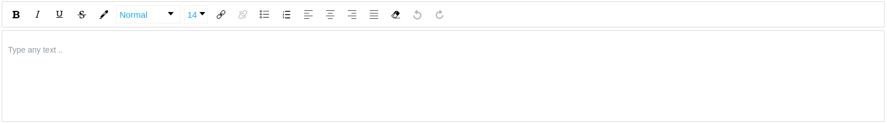

# react-wysiwyg-typescript

[](https://github.com/sumn2u/react-wysiwyg-typescript/issues) [](https://github.com/sumn2u/react-wysiwyg-typescript/network) [](https://github.com/sumn2u/react-wysiwyg-typescript/stargazers) [](https://github.com/sumn2u/react-wysiwyg-typescript/blob/master/LICENSE) [](https://twitter.com/intent/tweet?text=Wow:&url=https%3A%2F%2Fgithub.com%2Fsumn2u%2Freact-wysiwyg-typescript)



> A wrapper Component for react-draft-wysiwyg written in Typescript


This package require a css file, make sure you use webpack or similar tools for handler this file type.

## Table of Contents

- [Install](#install)
- [Usage](#usage)
- [Contribute](#contribute)
- [License](#license)

## Install

```sh
npm i react-wysiwyg-typescript -S

# or

yarn add react-wysiwyg-typescript

```

## Usage

```ts
import Draft, { htmlToDraft, draftToHtml, EmptyState, rawToDraft, draftToRaw , draftStateToHTML} from 'react-wysiwyg-typescript'

state = {
    editorState: htmlToDraft('Your html contents') // or use an EmptyState
}

<Draft
    editorState={this.state.editorState}
    onEditorStateChange={(editorState) => { this.setState({ editorState }) }}
/>

// save html to server

const html = draftToHtml(content)

// convert raw to draft

const toDraft = rawToDraft(content)

// convert draft to raw

const toRaw = draftToRaw(content)

// convert rawToDraft file to HTML

const toHTML = draftStateToHTML(content)

```

If you use antd's Form Component and you are ready to go.

```js

<FormItem label="Contents" {...alignProps} wrapperCol={{ span: 16 }}>
    {getFieldDecorator('Content', {
        rules: [{ required: true, message: 'Please leave a message...' }],
    })(
        <Draft
            editorState={this.state.editorState}
            onEditorStateChange={(editorState) => { this.setState({ editorState }) }}
        />
        )}
</FormItem>

// convert state to html

this.props.form.validateFields((err, data) => {
    if (err) {
        return
    }
    /**
    * do more check here.
    */
    if (data.Content) {
        data.Content = draftToHtml(data.Content)
    }
    // Now you have your html contents and ready to post to your server.
})

```

## Contribute


Small note: If editing the README, please conform to the [standard-readme](https://github.com/RichardLitt/standard-readme) specification.

## License

MIT © sumn2u
